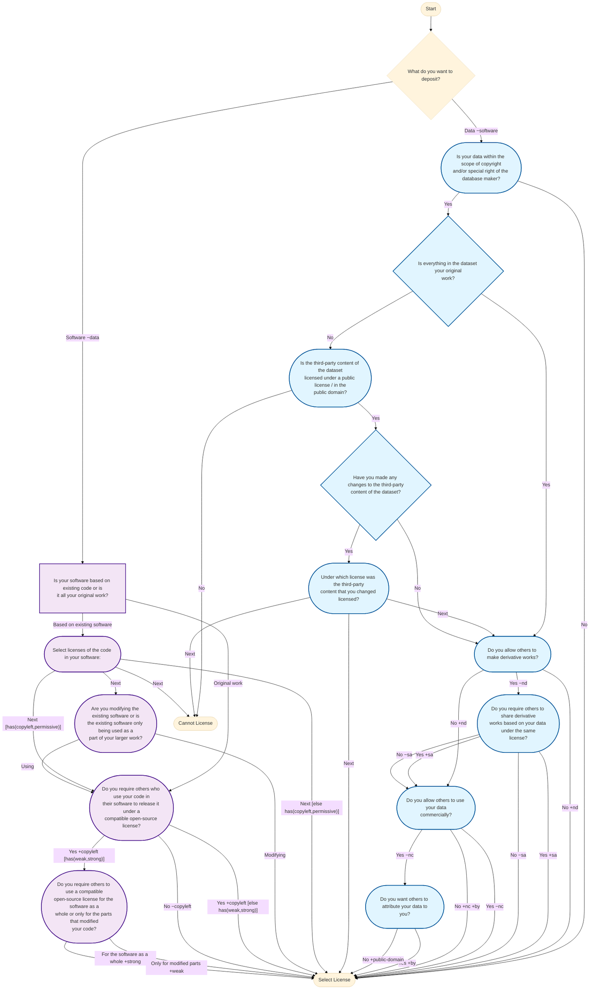
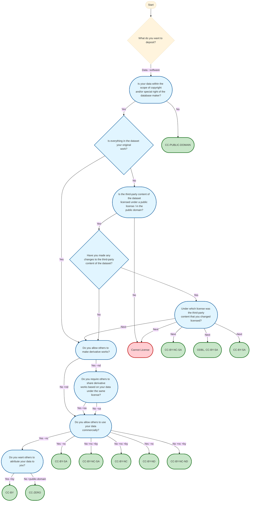
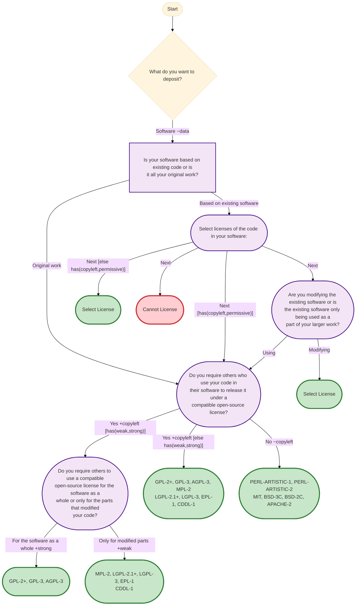

# License Selector State Graph

> **Auto-generated documentation** - Run `npm run generate-graph` to update

## Overview

This document visualizes the decision tree used by the Public License Selector. The selector guides users through a series of questions to recommend appropriate licenses for their software or data.

Edge labels on path-specific diagrams include filter operations applied at each step: **+category** keeps only licenses with that category; **−category** removes them. Terminal nodes show the exact set of licenses reachable along that path.

## Complete State Graph

## Data Licensing Path

## Software Licensing Path

## State Reference Table

| State | Question | Transitions | Type |
|-------|----------|-------------|------|
| KindOfContent | What do you want to deposit? | → YourSoftware → DataCopyrightable | Question |
| DataCopyrightable | Is your data within the scope of copyright and/or special right of the database maker? | → AllOriginal | ✅ Terminal |
| AllOriginal | Is everything in the dataset your original work? | → AllowDerivativeWorks → EnsureLicensing | Question |
| AllowDerivativeWorks | Do you allow others to make derivative works? | → ShareAlike → CommercialUse | ✅ Terminal (Conditional) |
| ShareAlike | Do you require others to share derivative works based on your data under the same license? | → CommercialUse → CommercialUse | ✅ Terminal (Conditional) |
| CommercialUse | Do you allow others to use your data commercially? | → DecideAttribute | ✅ Terminal (Conditional) |
| DecideAttribute | Do you want others to attribute your data to you? | N/A | ✅ Terminal |
| EnsureLicensing | Is the third-party content of the dataset licensed under a public license / in the public domain?  | → Changed3dPartyContent | ❌ Error |
| LicenseInteropData | Under which license was the third-party content that you changed licensed? | → AllowDerivativeWorks → AllowDerivativeWorks → AllowDerivativeWorks | ❌ Error |
| Changed3dPartyContent | Have you made any changes to the third-party content of the dataset? | → LicenseInteropData → AllowDerivativeWorks | Question |
| YourSoftware | Is your software based on existing code or is it all your original work? | → LicenseInteropSoftware → Copyleft | Question |
| LicenseInteropSoftware | Select licenses of the code in your software: | → Copyleft → ModifyingOrUsing | ❌ Error (Conditional) |
| ModifyingOrUsing | Are you modifying the existing software or is the existing software only being used as a part of your larger work? | → Copyleft | ✅ Terminal |
| Copyleft | Do you require others who use your code in their software to release it under a compatible open-source license? | → StrongCopyleft | ✅ Terminal (Conditional) |
| StrongCopyleft | Do you require others to use a compatible open-source license for the software as a whole or only for the parts that modified your code? | N/A | ✅ Terminal |

## Legend

- 🔹 **Blue nodes**: Data licensing path
- 🔸 **Purple nodes**: Software licensing path
- ✅ **Green nodes**: Terminal states — license set shown inside node
- ❌ **Red nodes**: Error states (cannot license)
- ♦️ **Diamond shapes**: Yes/No decisions
- ⬜ **Rectangles**: Multi-option questions
- **Edge labels**: `+cat` keeps licenses with category; `−cat` removes them

## How to Update

1. Modify `src/data/questions.coffee`
2. Run `npm run generate-graph`
3. Review the updated diagrams in this file
4. Commit changes to version control

## Related Files

- **Question Definitions**: `src/data/questions.coffee`
- **License Data**: `src/data/licenses.coffee`
- **Compatibility Matrix**: `src/data/compatibility.coffee`
- **Generator Script**: `scripts/generate-state-graph.js`
